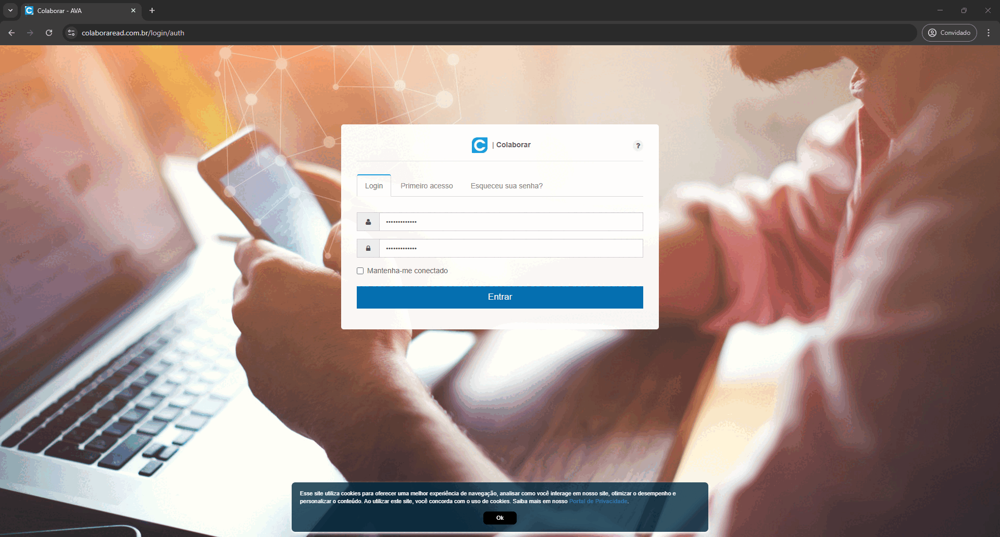

# py-selenium-scraper

Projeto que automatiza o acesso à plataforma **[Colaborar da Anhanguera](https://www.colaboraread.com.br/login/auth)**, exportando datas de atividades em um arquivo ICS (iCalendar), utilizando Selenium para web scraping.

<p align="center">
  
</p>

<a href="https://www.python.org/">
  
</a>
<a href="https://python-poetry.org/">
  
</a>
<a href="https://www.selenium.dev/">
  
</a>
<a href="https://www.anhanguera.com/">
  
</a>
<a href="https://www.colaboraread.com.br/login/auth">
  
</a>

---

## Requisitos

- [Python](https://www.python.org/downloads/)
- [Pyenv](https://pypi.org/project/pyenv/)
- [Poetry](https://python-poetry.org/)
- [ChromeDriver](https://googlechromelabs.github.io/chrome-for-testing/)

Para utilizar este projeto, recomenda-se o uso do Pyenv para gerenciar versões do Python e do Poetry para gerenciar as dependências definidas no arquivo `pyproject.toml`.

- Para instalar e configurar o Pyenv e o Poetry no Windows, confira [este vídeo](https://www.youtube.com/watch?v=547Jr26duHQ).
- Para aprender como gerenciar múltiplas versões do Python usando o Pyenv, leia [este artigo](https://realpython.com/intro-to-pyenv/).
- Para instalar o ChromeDriver, confira [este vídeo](https://www.youtube.com/watch?v=FT0cWOUkCzI) ou acesse diretamente [aqui](https://googlechromelabs.github.io/chrome-for-testing/#stable) e escolha a versão stable para o seu Windows (`win32` ou `win64`).
- Também é possível instalar o ChromeDriver utilizando o Winget, como descrito no [additional_instructions.md](./additional_instructions.md).

## Configuração do Projeto

### 1. Clonando o Repositório

Para começar, clone o repositório do projeto:

```bash
git clone https://github.com/pagueru/py-selenium-scraper
cd py-selenium-scraper
```

### 2. Preparando o Ambiente de Desenvolvimento

O projeto requer a versão 3.12.7 do Python:

```bash
pyenv update
pyenv install 3.12.7
pyenv local 3.12.7
```

Configure o Poetry para gerenciar as dependências do projeto:

```bash
poetry env use 3.12.7
poetry shell
poetry install
```

## 3. Personalizando o Arquivo de Configuração

Renomeie o arquivo `config_template.yml` para `config.yml` com suas informações:

  ```yaml
  # Configurações do ambiente
  profile_mode: info

  # Caminho do ChromeDriver
  chromedriver: C:\caminho\para\chromedriver.exe

  # Data de acesso ao portal
  usuario: SEU_CPF
  senha: SUA_SENHA

  # Informações do aluno
  matricula: SUA_MATRICULA

  # Informações do curso utilizadas no campo PRODID do arquivo .ics gerado
  nome_curso: NOME_DO_CURSO
  semestre: 1o
  nome_aluno: SEU_NOME

  # URL's do portal
  colaborar_url: https://www.colaboraread.com.br/login/auth
  colaborar_index_url: https://www.colaboraread.com.br/aluno/timeline/index

  # Atividades ignoradas
  atividades_ignoradas: [
    Conteúdo WEB,
    Leitura,
    Engajamento AVA,
    Teleaula
  ]
  ```

## 4. Executando o Projeto

  Como o projeto utiliza `[tool.poetry.scripts]` no arquivo `pyproject.toml`, você pode executar o script diretamente utilizando `poetry run main`

  ```bash
  poetry run main
  ```

  ou

  ```bash
  poetry run python src/main.py
  ```

<p align="center">
  
</p>

O script acessa o portal e exporta as atividades para um arquivo ICS. Os dados gerados também estarão disponíveis em JSON e YAML para melhor visualização.

Abaixo está um exemplo de como os dados são organizados no formato YAML, com detalhes sobre as atividades, períodos e tipos de tarefas:

```ics
BEGIN:VCALENDAR
VERSION:2.0
BEGIN:VCALENDAR
VERSION:2.0
PRODID:-//Raphael Coelho//5o Superior de Tecnologia em Inteligência de Mercado e Análise de Dados//PT-BR
BEGIN:VEVENT
SUMMARY:Início Av1 - Administração e Negócios
DTSTART;VALUE=DATE:030225
DESCRIPTION:Atividade da disciplina Administração e Negócios
END:VEVENTBEGIN:VCALENDAR
```

### Exemplos de Retornos

<details><summary><kbd>Formato YAML</kbd></summary>

```yaml
Web Analytics:
  atividades:
  - nome_atividade: Relatório de Aula Prática - Web Analytics
    periodo: 03/02/25 - 17/05/25
    tipo_atividade: Portfólio
  - nome_atividade: Av1 - Web Analytics
    periodo: 14/04/25 - 26/05/25
    tipo_atividade: Avaliação Virtual
  - nome_atividade: Av2 - Web Analytics
    periodo: 14/04/25 - 02/06/25
    tipo_atividade: Avaliação Virtual
  - nome_atividade: Av - Subst. 1 - Web Analytics
    periodo: 03/06/25 - 07/06/25
    tipo_atividade: Avaliação Virtual
  - nome_atividade: Av - Subst. 2 - Web Analytics
    periodo: 03/06/25 - 07/06/25
    tipo_atividade: Avaliação Virtual
  - nome_atividade: Prova Presencial - 1º Chamada - Web Analytics
    periodo: 24/05/25 - 31/05/25
    tipo_atividade: Prova Presencial da Disciplina
  - nome_atividade: Prova Presencial - 2º Chamada - Web Analytics
    periodo: 09/06/25 - 14/06/25
    tipo_atividade: Prova Presencial da Disciplina
  - nome_atividade: Prova Presencial - Recuperação - Web Analytics
    periodo: 16/06/25 - 21/06/25
    tipo_atividade: Prova Presencial da Disciplina
  link_disciplina: https://www.colaboraread.com.br/aluno/timeline/index/XXXXXXXXXX?ofertaDisciplinaId=XXXXXXX
```

<br/> </details>

## Contato

GitHub: [pagueru](https://github.com/pagueru/)

LinkedIn: [Raphael Coelho](https://www.linkedin.com/in/raphaelhvcoelho/)

E-mail: [raphael.phael@gmail.com](mailto:raphael.phael@gmail.com)
